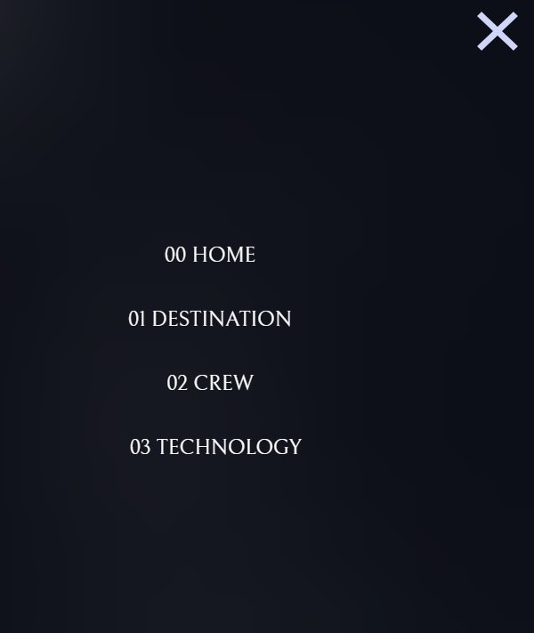
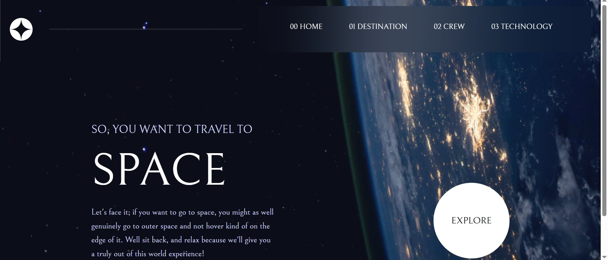

# Space Tourism Website

A responsive and interactive **Space Tourism multi-page website** built with **TypeScript, Tailwind CSS, and Vite**.  
The project replicates a space travel company's promotional website, featuring pages for **Home, Destination, Crew, and Technology**.

---

## Features

- **Responsive Design** – Mobile-first approach with smooth desktop layouts.
- **Tailwind CSS** – Utility-first styling for consistency and maintainability.
- **TypeScript + Vite** – Fast development with type safety.
- **Animated Mobile Menu** – Slide-in/out navigation with hamburger & close icons.

- **Page Sections**
- **Home** – Introduction to space tourism.
- **Destination** – Explore planets with details and images.
- **Crew** – Meet the space crew.
- **Technology** – Learn about space travel technology.

- **Active State Management** –
- On **mobile**, active tabs highlight with a right-side border.
- On **desktop**, active tabs highlight with a bottom indicator aligned beneath the nav container.
- **Background Images** – Unique designs for each page (mobile, tablet, desktop).

---

## Tech Stack

- [Vite](https://vitejs.dev/) – Bundler for fast dev & builds
- [TypeScript](https://www.typescriptlang.org/) – Strongly typed JavaScript
- [Tailwind CSS](https://tailwindcss.com/) – Utility-first CSS framework

---

## Project Structure

space-tourism/
├── index.html # Home page
├── destination.html # Destination page
├── crew.html # Crew page
├── technology.html # Technology page
├── src/
│ ├── assets/ # Images & icons
│ │ ├── shared/ # Shared assets (logo, icons, line divider)
│ │ ├── destination/ # Planet images
│ │ ├── crew/ # Crew images
│ │ └── technology/ # Technology images
│ ├── styles.css # Tailwind CSS entry file
│ └── main.ts # TypeScript logic (menu, active states)
│ └──crew.ts #TypeScript logic (menu, active states)
│ └──technology.ts #TypeScript logic (menu, active states)
├── dist/ # Production build (generated)
├── tailwind.config.js # Tailwind configuration
├── tsconfig.json # TypeScript configuration
└── vite.config.ts # Vite configuration

---

## 🚀 Getting Started

### 1. Clone the Repository

```bash
git clone https://github.com/your-username/space-tourism.git
cd space-tourism


npm install
npm run dev
npm run build
```

## Usage

On mobile:

Click the hamburger menu to open navigation.

Active page is marked with a vertical right border.

On desktop:

Navigation links are inline.

Active page is highlighted with a bottom indicator aligned to the far edge of the container.

## Screenshots



[Desktop](./src/assets/screenshots/20250906_194533.jpg)
[Desktop](./src/assets/screenshots/20250906_195232.jpg)
[Desktop](./src/assets/screenshots/20250906_195032.jpg)

Credits

Challenge inspired by Frontend Mentor – Space Tourism
.

Developed with ❤️ by Funmilola Akanbi.

---
